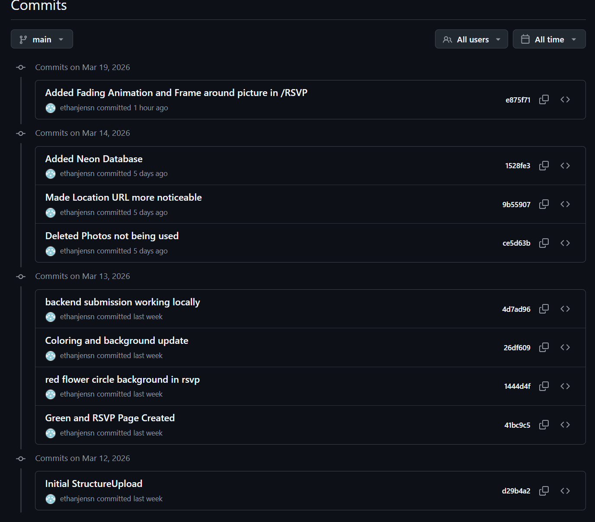

# Wedding Website (Flask)

A full-stack wedding RSVP website with a responsive RSVP form and an admin dashboard for managing guest responses.



*This repository was created to keep the personal wedding website separate from professional portfolios. The image above shows the commit history from the original private repository.*

## Website Overview

The website provides:
- **Landing Page**: Beautiful introduction with smooth animations and event details
- **RSVP Form**: Guest response collection with dietary preferences and attendance confirmation
- **Admin Dashboard**: Secure view of all RSVP submissions for event planning
- **Loading Animations**: Smooth fade-in effects and transitions for enhanced user experience

## Technical Architecture

### Database Choice: Neon vs Render
The application uses **Neon Database** instead of Render's built-in database due to a critical limitation:

**Issue**: Render's free database tier automatically deletes databases after **15 minutes of inactivity**, causing data loss and requiring manual database recreation.

**Solution**: Neon Database provides persistent storage that remains available regardless of application activity, ensuring RSVP data is never lost.

### Loading Animations
The website features smooth CSS animations:
- **Fade-in effects** on page load for content elements
- **Transition animations** between sections
- **Hover states** on interactive elements
- **Responsive design** that adapts to all screen sizes

## Prerequisites
- Python 3.9 or newer
- Neon Database account (for production deployment)

## Environment Setup
Set the Neon Database connection string as an environment variable:
```powershell
$env:DATABASE_URL = "your_neon_database_connection_string"
# or on Linux/Mac:
export DATABASE_URL="your_neon_database_connection_string"
```

For deployment, configure the DATABASE_URL environment variable in your hosting platform's settings.

## Run the server
```powershell
flask --app app run
# or
python app.py
```

Visit http://localhost:5000/ to confirm the site loads.

## Deployment Notes
- Use Neon Database for persistent storage
- Configure environment variables in your hosting platform
- The app is optimized for Render deployment with proper database handling
