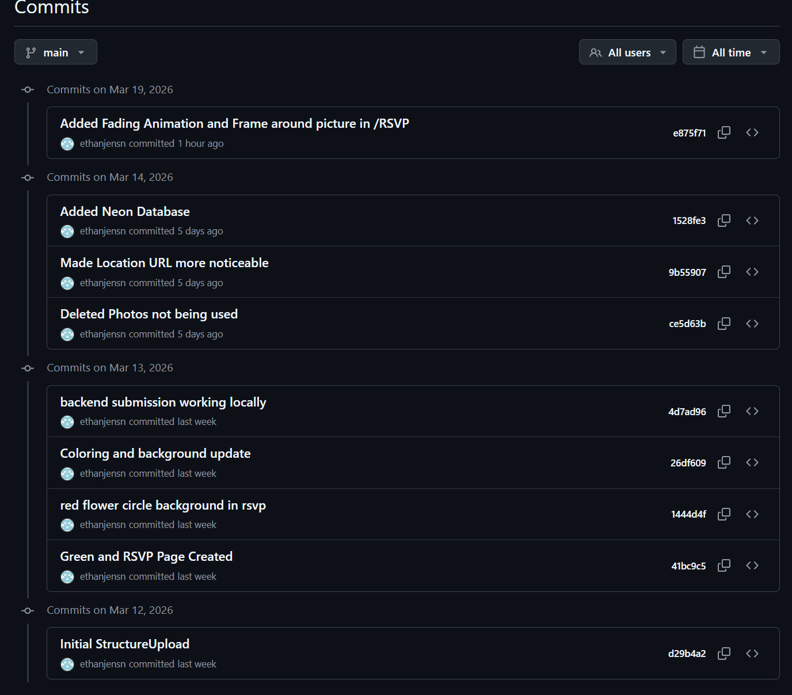

# Wedding Website (Flask)

A full-stack wedding RSVP website with a responsive RSVP form and an admin dashboard for managing guest responses.



*This repository was created to keep the personal wedding website separate from professional portfolios. The image above shows the commit history from the original private repository.*

## Website Overview

The website provides:
- **Landing Page**: Beautiful introduction with smooth animations and event details
- **RSVP Form**: Guest response collection with dietary preferences and attendance confirmation
- **Admin Dashboard**: Secure view of all RSVP submissions for event planning
- **Loading Animations**: Smooth fade-in effects and transitions for enhanced user experience

## Project Metrics

Auto-generated by the built-in metrics pipeline (`python -m metrics`) — see [PROJECT_METRICS.md](PROJECT_METRICS.md) for the full report.

| Category | Result |
| --- | --- |
| Lighthouse Performance | 82 |
| Accessibility / Best Practices / SEO | 100 / 96 / 90 |
| Largest Contentful Paint | 4.4s (improved 87% from 32.9s after asset optimization) |
| Test coverage | 96% across 16 unit tests (in-memory DB mock) |
| Code quality (pylint) | 9.38/10 |
| Average API latency | 9 ms across 4 benchmarked endpoints |
| REST endpoints / Pages | 7 / 5 |
| Security | Rate limiting, CSRF protection, secure HTTP headers, pydantic validation, parameterized SQL |

## Technical Architecture

### Database Choice: Neon vs Render
The application uses **Neon Database** instead of Render's built-in database due to a critical limitation:

**Issue**: Render's free database tier automatically deletes databases after **15 minutes of inactivity**, causing data loss and requiring manual database recreation.

**Solution**: Neon Database provides persistent storage that remains available regardless of application activity, ensuring RSVP data is never lost.

### Loading Animations
The website features smooth CSS animations:
- **Fade-in effects** on page load for content elements
- **Transition animations** between sections
- **Hover states** on interactive elements
- **Responsive design** that adapts to all screen sizes

## Prerequisites
- Python 3.9 or newer
- Neon Database account (for production deployment)

## Environment Setup

### Database (required)
Set the Neon Database connection string as an environment variable:
```powershell
$env:DATABASE_URL = "your_neon_database_connection_string"
# or on Linux/Mac:
export DATABASE_URL="your_neon_database_connection_string"
```

### Email Notifications (optional)
The app can send an email notification whenever a guest submits an RSVP, using [Resend](https://resend.com). If these are not set, RSVPs are still saved to the database — emails are simply skipped.

```powershell
$env:RESEND_API_KEY = "your_resend_api_key"        # API key from resend.com
$env:RESEND_FROM_EMAIL = "onboarding@resend.dev"   # sender address (use your verified domain in production)
$env:NOTIFY_EMAILS = "you@example.com,partner@example.com"  # comma-separated recipients
# or on Linux/Mac:
export RESEND_API_KEY="your_resend_api_key"
export RESEND_FROM_EMAIL="onboarding@resend.dev"
export NOTIFY_EMAILS="you@example.com,partner@example.com"
```

- **RESEND_API_KEY**: API key from your Resend account.
- **RESEND_FROM_EMAIL**: sender address. Defaults to Resend's shared test sender `onboarding@resend.dev`; set this to an address on your verified domain for production.
- **NOTIFY_EMAILS**: comma-separated list of addresses that receive a notification for each new RSVP.

### Admin Dashboard Path (optional)
The admin dashboard is served at a secret URL path instead of a predictable `/admin` route:
```powershell
$env:ADMIN_PATH = "your-secret-path"
# or on Linux/Mac:
export ADMIN_PATH="your-secret-path"
```
If unset, a built-in default path is used. The dashboard is then available at `http://localhost:5000/your-secret-path`.

### Security (built in)
The app includes rate limiting on `/submit_rsvp` (Flask-Limiter), CSRF protection on forms (Flask-WTF), and secure HTTP headers (Flask-Talisman). For production, set a stable `SECRET_KEY` so CSRF tokens survive restarts:
```powershell
$env:SECRET_KEY = "a-long-random-string"
# or on Linux/Mac:
export SECRET_KEY="a-long-random-string"
```

For deployment, configure all of these environment variables in your hosting platform's settings.

## Run the server
```powershell
flask --app app run
# or
python app.py
```

Visit http://localhost:5000/ to confirm the site loads.

## Metrics

Generate an engineering metrics report (`PROJECT_METRICS.md`) with:

```powershell
python -m metrics
```

- **Static metrics** (routes, templates, database schema, security patterns, code statistics, lint score, tests + coverage) are always collected by reading the source — no network or database access. Lint score needs `pylint` and coverage needs `coverage.py` (both in `requirements-dev.txt`); otherwise those fields show TODO placeholders.
- **Live metrics** (Lighthouse scores and API latency benchmarks) only run when explicitly requested: `python -m metrics --live`. The script boots the app **locally** on port `5055` (your deployed site is never contacted), measures it, and shuts it down. Without `DATABASE_URL` it uses an in-memory database mock, so no hosted database is touched either. The default benchmark routes are GET-only and do not query the database. Lighthouse additionally requires Node.js + Chrome (`npm install -g lighthouse`); otherwise those sections show TODO placeholders.
- The benchmarked routes are configurable via the `ROUTES` list at the top of `metrics/api_benchmark.py` (GET-only by default, to avoid database writes and notification emails).
- To change the report layout, edit `metrics/project_metrics_template.md`.

## Deployment Notes
- Use Neon Database for persistent storage
- Configure environment variables in your hosting platform
- The app is optimized for Render deployment with proper database handling
